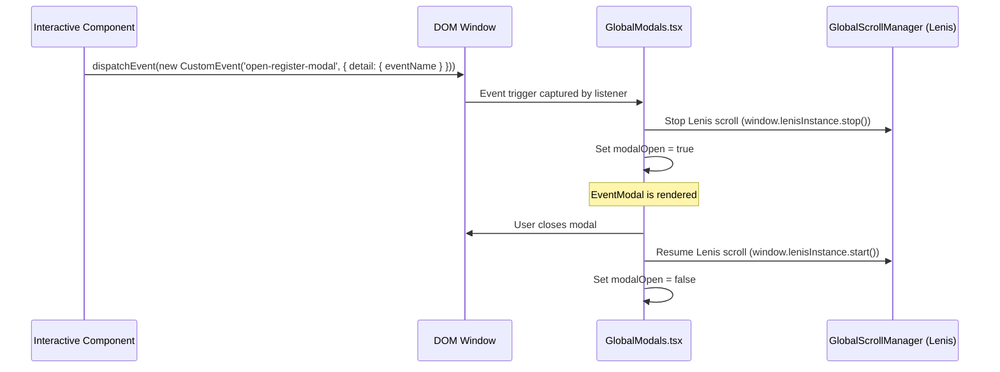

# 📖 AI Catalog — AURON Forum Developer & Agent Handbook

Welcome to the definitive AI Architecture and Development Handbook for the AURON Forum web application. This document acts as an exhaustive system blueprint. If you are an AI coding assistant or a developer onboarding to this project, this file contains everything you need to understand, maintain, debug, and extend this codebase as if you built it yourself.

---

## 🏗️ 1. Core Architecture & Philosophy

The application is a high-fidelity, high-performance community portal built on **Next.js 16 (App Router)** and **React 19**, written in **TypeScript**. 

### Dynamic-Interactive Edge Philosophy
To achieve maximum rendering speed and visual fluidity:
* **Inertial Smooth Scrolling:** Managed globally by [Lenis](https://lenis.darkroom.engineering/) and integrated directly with GreenSock (GSAP) ScrollTrigger timeline updates.
* **Double-Layer Custom Cursor:** Tracks page coordinates in real-time, adapting its scale and style on interactive target hits, with spring-like magnetic pull logic.
* **Tilt & Spotlight Lighting:** Interactive components utilize pure CSS variables for mouse spotlight coordinate mapping combined with 3D matrix card tilts.
* **Zero-Cascading Hydration Resets:** State dependencies are structured around render-time derivation to prevent hydration mismatches and cascade-re-renders.
* **Conditional Overlay Mounts:** Modals are conditionally rendered on boolean triggers, ensuring clean resets of inner states upon closures.

---

## 📁 2. File & Directory Blueprints

```
auron/
├── app/                              # Next.js App Router Root
│   ├── achievements/                 # Hall of Fame and Testimonials Page
│   │   └── page.tsx                  # Layout importing Achievements & Alumni components
│   ├── certificates/                 # Certificate Portal Page
│   │   └── page.tsx                  # Static route handling server-side Excel import parsing
│   ├── committee/                    # Executive Committee Page
│   │   └── page.tsx                  # Static route loading Committee Client component
│   ├── contact/                      # Contact Us Page
│   │   └── page.tsx                  # Loads EmailJS contact form wrapper
│   ├── events/                       # Event Hub Page
│   │   └── page.tsx                  # Main router page executing client controllers
│   ├── faqs/                         # Interactive Accordion Page
│   │   └── page.tsx                  # Loads Faq component list
│   ├── gallery/                      # Media Showcase Page
│   │   └── page.tsx                  # Executes GalleryPageClient for media lightbox triggers
│   ├── timeline/                     # Milestones Journey Page
│   │   └── page.tsx                  # Integrates GSAP ScrollTrigger timeline wrapper
│   ├── vision/                       # Department core values Page
│   │   └── page.tsx                  # Renders core Vision and Mission cards
│   ├── globals.css                   # Core Stylesheet containing all CSS Variables, Custom themes & UI elements
│   ├── layout.tsx                    # Root Layout configuring custom fonts, SEO Metadata and Global wrappers
│   └── page.tsx                      # Landing homepage hosting Hero, Stats & Sponsors
├── components/                       # Modular UI Components
│   ├── Achievements.tsx              # Renders national awards cards
│   ├── Alumni.tsx                    # Graduate networks testimonials cards
│   ├── CertificatesClient.tsx        # Client canvas rendering & custom dropdown interface
│   ├── Committee.tsx                 # Leaders list with wing filtering and sparkly hover overlays
│   ├── Contact.tsx                   # EmailJS integrated input form with floating labels
│   ├── CustomCursor.tsx              # GSAP client mouse coordinator and magnet pulling listeners
│   ├── EventModal.tsx                # Ticket validation registration form modal
│   ├── Events.tsx                    # Featured events display with countdown and registration triggers
│   ├── EventsPageClient.tsx          # Client controller linking Events & PastEvents to global modals
│   ├── Faq.tsx                       # Details-summary style accordion list with height transitions
│   ├── Footer.tsx                    # Global site footer containing copyright and social vectors
│   ├── GalleryPageClient.tsx         # Client controller dispatching lightbox images on click
│   ├── GlobalModals.tsx              # Core modal listener (Lightbox, Event registration, custom cursor mounting)
│   ├── GlobalScrollManager.tsx       # Lenis initialization, RAF loop, reveal elements animations
│   ├── Hero.tsx                      # Canvas background particles particle system, theme observer, logo vectors
│   ├── InitialLoaderWrapper.tsx      # Handles the entry logo intro splash animation using session storage
│   ├── Lightbox.tsx                  # Fullscreen image swiper with derived-state index synchronizations
│   ├── Loader.tsx                    # Visual layout spinner markup and GSAP intro sequences
│   ├── Navbar.tsx                    # Global responsive header, scrolled blur styles, mobile layout controls
│   ├── PastEvents.tsx                # Gallery card grid sorting by category and operations wing
│   ├── Sponsors.tsx                  # Logotype scrolling grids for corporate partners
│   ├── Stats.tsx                     # Numeric department milestones
│   ├── Testimonials.tsx              # Alumni sliders (reused inside Alumni page)
│   ├── Timeline.tsx                  # Horizontal timeline cards synced to scroll heights
│   └── VisionMission.tsx             # 3D interactive tilting Vision and Mission cards
├── data/                             # Mock databases
│   ├── committee.ts                  # Array of leaders containing name, wing, tier, role, social links, and photos
│   ├── events.ts                     # Arrays representing upcoming & past events schedules
│   └── faqs.ts                       # Frequently Asked Questions database
├── public/                           # Vector icons, logo images, and static resources
├── .env.example                      # Production template environment credentials
├── package.json                      # Dependency manager (react 19, next 16, gsap, lenis)
└── start.bat                         # Automated Windows local environment setup script
```

---

## 🎨 3. Styling & Color Systems

All custom designs are written in Vanilla CSS within [app/globals.css](file:///c:/Project/Auron/Auron_Website/auron/app/globals.css).

### 3.1 Custom Theming System (Theme Inversion Warning)
The theme configuration utilizes a custom structure. **The default `:root` selector holds the "Dark" theme values, and the `[data-theme="light"]` attribute selector overrides variables with "Gold" dark styling.**

* **Default Theme (White & Dark Blue):** Active on load when no theme state is configured. It sets a clean white backdrop with blue accent borders.
* **Light Theme Class (Dark Navy & Gold):** Activated when `data-theme="light"` is assigned to `<html>`. It defines a dark space background with gold/orange gradients.

#### Variable Definitions Breakdown:
```css
:root {
  --bg-primary: #ffffff;
  --bg-secondary: #f5f8fc;
  --bg-tertiary: #e8eff7;
  --bg-glass: rgba(255, 255, 255, 0.7);
  --text-primary: #0a1628;
  --text-secondary: #2c3e5a;
  --text-muted: #6b7c97;
  --color-gold: #0d47a1; /* Maps accent color to Blue in default mode */
  --gold-gradient: linear-gradient(135deg, #0d47a1 0%, #1565c0 25%, #1976d2 50%, #1e88e5 75%, #0d47a1 100%);
}

[data-theme="light"] {
  --bg-primary: #020b18;
  --bg-secondary: #051329;
  --bg-tertiary: #081e3f;
  --bg-glass: rgba(2, 11, 24, 0.5);
  --text-primary: #ffffff;
  --text-secondary: #abc4e3;
  --text-muted: #6481a5;
  --color-gold: #d4af37; /* Overrides accent to gold/amber */
  --gold-gradient: linear-gradient(135deg, #bf953f 0%, #fcf6ba 25%, #b38728 50%, #fbf5b7 75%, #aa771c 100%);
}
```

### 3.2 Glassmorphism Components
Cards are built using glassmorphism layers to match the modern fluid layout:
* **`.glass-card`:** Custom overlays featuring background blur (`backdrop-filter: blur(14px)`), semi-transparent borders, and radial glow backdrops.
* **`.card-border-glow`:** Absolute positioned elements reflecting card bounds with high z-index and glowing radial highlights.
* **`--mouse-x` and `--mouse-y` variables:** Injected dynamically by component hover handlers to position the radial spotlight gradient.

```css
.glass-card {
  background: var(--bg-glass);
  border: 1px solid var(--border-color);
  backdrop-filter: blur(14px);
  position: relative;
  overflow: hidden;
}

.glass-card::before {
  content: "";
  position: absolute;
  top: 0; left: 0; right: 0; bottom: 0;
  background: radial-gradient(800px circle at var(--mouse-x, 0) var(--mouse-y, 0), var(--border-glow-color), transparent 40%);
  z-index: 3;
  pointer-events: none;
}
```

---

## ⚡ 4. Animation & Interaction Frameworks

Animations are driven by **GSAP (GreenSock Animation Platform)** and **Lenis Smooth Scroll**.

### 4.1 Custom Cursor Coordination ([components/CustomCursor.tsx](file:///c:/Project/Auron/Auron_Website/auron/components/CustomCursor.tsx))
Implements a dual-layered cursor system containing:
1. **`.custom-cursor` (Direct Track):** Inner dot pinned directly to mouse client coordinates (`clientX`/`clientY`).
2. **`.custom-cursor-follower` (Inertial Lag):** Outer circle tracking the mouse coordinates with a Linear Interpolation (LERP) easing function.

#### Core Loop:
```typescript
let mouseX = 0, mouseY = 0;
let followerX = 0, followerY = 0;

const onMouseMove = (e: MouseEvent) => {
  mouseX = e.clientX;
  mouseY = e.clientY;
  cursor.style.left = mouseX + 'px';
  cursor.style.top = mouseY + 'px';
};

const tickFollower = () => {
  followerX += (mouseX - followerX) * 0.15; // LERP formula
  followerY += (mouseY - followerY) * 0.15;
  follower.style.left = followerX + 'px';
  follower.style.top = followerY + 'px';
  frameId = requestAnimationFrame(tickFollower);
};
```

#### Magnetic Snap Pull:
Adding `.magnetic-element` class triggers snapping. On `mousemove`, the component calculates offsets from the center of the element and uses GSAP to translate the element toward the cursor:
```typescript
const rect = htmlEl.getBoundingClientRect();
const x = e.clientX - rect.left - rect.width / 2;
const y = e.clientY - rect.top - rect.height / 2;
gsap.to(htmlEl, { x: x * 0.35, y: y * 0.35, duration: 0.3, ease: "power2.out" });
```
Upon `mouseleave`, an elastic GSAP ease snaps the element back to center:
```typescript
gsap.to(htmlEl, { x: 0, y: 0, duration: 0.5, ease: "elastic.out(1, 0.3)" });
```

#### Interactive Scaling Classes:
The custom cursor monitors `mouseover` and `mouseout` events. Target elements matching the selector list below receive `.cursor-hover` and `.cursor-follower-hover` classes for dynamic visual feedback:
* `a, button, .filter-btn, .wing-filter-btn, .bearer-card, .event-card, .glass-card, .testimonial-indicator, .faq-question, .test-nav-btn, .lightbox-arrow, .lightbox-close`

---

### 4.2 Smooth Scrolling & Viewport Reveals ([components/GlobalScrollManager.tsx](file:///c:/Project/Auron/Auron_Website/auron/components/GlobalScrollManager.tsx))
Synchronizes viewport scroll loops with Lenis smooth-scroller and GSAP ScrollTrigger.
* **Instance Caching:** The instantiated Lenis object is mapped directly to `window.lenisInstance` to allow lifecycle stop/start controls during modal overlays.
* **Reveal Elements (`.reveal-element`):** Registers ScrollTrigger on elements, translating them upward and fading them in once they cross the `top 90%` viewport threshold.
* **Parallax Background Elements (`.gold-glow`):** Synchronizes vertical position offsets (`yPercent: -20`) with ScrollTrigger scrubs.

---

### 4.3 Scroll-Linked Height Timelines ([components/Timeline.tsx](file:///c:/Project/Auron/Auron_Website/auron/components/Timeline.tsx))
Tracks scroll progression down the timeline section.
* Uses GSAP context scoping (`gsap.context()`) to cleanup listeners safely.
* Drives the high-level progression bar element (`#timeline-scroll-progress`) height from `0%` to `100%` corresponding to the timeline container boundaries:
```typescript
gsap.fromTo(
  progressBar,
  { height: "0%" },
  {
    height: "100%",
    scrollTrigger: {
      trigger: container,
      start: "top 80%",
      end: "bottom 20%",
      scrub: 0.3,
    },
  }
);
```

---

## 🔀 5. Global State & Communication Architecture

To avoid complex state-management architectures (Redux, Zustand) and keep page rendering fast, the application coordinates interactive modules (modals, lightboxes) using **custom DOM events**.



### 5.1 Registration Modal Triggers
When clicking "Register Now" or "Get Ticket" cards:
1. Components dispatch a custom `'open-register-modal'` event containing the selected event's name.
2. [GlobalModals.tsx](file:///c:/Project/Auron/Auron_Website/auron/components/GlobalModals.tsx) intercepts the event, stops smooth scrolling via `window.lenisInstance.stop()`, disables viewport overflow, and mounts [EventModal.tsx](file:///c:/Project/Auron/Auron_Website/auron/components/EventModal.tsx).
3. The modal features forms with floating input labels, roll validation, regex email checking, and standard ticket animations.
4. On closure, the page triggers `window.lenisInstance.start()` to restore viewport scrolling.

### 5.2 Lightbox Swiper Triggers
When clicking gallery images:
1. Components dispatch the `'open-lightbox'` event with an payload structure: `{ index, images: [{ src, title }] }`.
2. [GlobalModals.tsx](file:///c:/Project/Auron/Auron_Website/auron/components/GlobalModals.tsx) intercepts the payload, configures [Lightbox.tsx](file:///c:/Project/Auron/Auron_Website/auron/components/Lightbox.tsx), and locks scrolling.
3. [Lightbox.tsx](file:///c:/Project/Auron/Auron_Website/auron/components/Lightbox.tsx) uses a **Derived State** design pattern to align the current slider index with the clicked index to prevent sync lag between React render passes:
```typescript
const [prevInitialIndex, setPrevInitialIndex] = useState(initialIndex);
const [currentIndex, setCurrentIndex] = useState(initialIndex);

if (initialIndex !== prevInitialIndex) {
  setPrevInitialIndex(initialIndex);
  setCurrentIndex(initialIndex);
}
```

---

## 🔌 6. External Integrations (EmailJS System)

The Contact page ([components/Contact.tsx](file:///c:/Project/Auron/Auron_Website/auron/components/Contact.tsx)) dispatches submissions directly to the department's email inbox using the `@emailjs/browser` client SDK.

### 6.1 Credentials Structure
The component loads connection credentials from environment variables. Local environment fallback structures are hardcoded to direct mails to the forum's default account:

* **Default Mailbox Keys:**
  * `Service ID:` `service_evkz5x8`
  * `Template ID:` `template_2cu08jp`
  * `Public API Key:` `aB8r5qyVP7paTnBCe`

### 6.2 Environment Variable Configuration
To configure or override target mail routes in production:
```env
NEXT_PUBLIC_EMAILJS_SERVICE_ID=your_custom_service_id
NEXT_PUBLIC_EMAILJS_TEMPLATE_ID=your_custom_template_id
NEXT_PUBLIC_EMAILJS_PUBLIC_KEY=your_custom_public_key
```

---

## 🛠️ 7. Extension Playbook (Step-by-Step Guides)

This playbook explains how to add new pages, components, animations, and data records.

### 7.1 How to Add a New Page
1. **Create Directory:** Under `app/`, create a new folder (e.g. `app/news/`).
2. **Create Page File:** Create `page.tsx`. Add SEO metadata and import page client assets:
   ```typescript
   import type { Metadata } from "next";
   import NewsPageClient from "@/components/NewsPageClient";

   export const metadata: Metadata = {
     title: "Latest News | AURON Forum",
     description: "Updates and announcements from the committee.",
   };

   export default function NewsPage() {
     return <NewsPageClient />;
   }
   ```
3. **Register Route link:** Add the page route to the `navLinks` list in [Navbar.tsx](file:///c:/Project/Auron/Auron_Website/auron/components/Navbar.tsx) to add it to the header navigation.

---

### 7.2 How to Add a New Interactive Component
Follow this template to construct custom interactive sections that align with the site's layout conventions and animations:

```typescript
"use client";

import React, { useRef } from "react";

export default function CustomShowcase() {
  const cardRef = useRef<HTMLDivElement>(null);

  // Mouse 3D Rotate & Glow Spotlight Effect
  const handleMouseMove = (e: React.MouseEvent<HTMLDivElement>) => {
    const card = cardRef.current;
    if (!card) return;
    const rect = card.getBoundingClientRect();
    const x = e.clientX - rect.left;
    const y = e.clientY - rect.top;

    const rotateX = -((y - rect.height / 2) / rect.height) * 8;
    const rotateY = ((x - rect.width / 2) / rect.width) * 8;

    card.style.transform = `rotateX(${rotateX}deg) rotateY(${rotateY}deg) translateY(-4px)`;
    card.style.setProperty("--mouse-x", `${x}px`);
    card.style.setProperty("--mouse-y", `${y}px`);
  };

  const handleMouseLeave = () => {
    if (cardRef.current) {
      cardRef.current.style.transform = "rotateX(0deg) rotateY(0deg) translateY(0px)";
    }
  };

  return (
    <section className="section-padding">
      <div className="container">
        {/* Scroll Reveal Wrapper */}
        <div className="section-header reveal-element">
          <span className="section-subtitle">Highlights</span>
          <h2 className="section-title">New Showcase</h2>
        </div>

        {/* 3D Glass Card wrapper */}
        <div 
          ref={cardRef}
          className="glass-card tilt-card reveal-element magnetic-element"
          onMouseMove={handleMouseMove}
          onMouseLeave={handleMouseLeave}
        >
          <div className="spotlight" />
          <div className="card-border-glow" />
          <h4>Card Heading</h4>
        </div>
      </div>
    </section>
  );
}
```

#### Key Styling Conventions checklist:
- Wrap visual boundaries inside `.section-padding` and `.container`.
- Apply `.reveal-element` to components that should fade in dynamically when scrolled into view.
- Apply `.magnetic-element` to trigger snapping behaviors for elements like buttons or custom tags.
- Nest `.spotlight` and `.card-border-glow` inside `.glass-card` elements to enable the hover spotlight tracker.

---

### 7.3 How to Add Static Data
* **Events Database:** Update [data/events.ts](file:///c:/Project/Auron/Auron_Website/auron/data/events.ts). Append a new event object to `UPCOMING_EVENTS_DATA` or `PAST_EVENTS_DATA`. Ensure the `wing` property is set to `'technical'` or `'non-technical'` to preserve category filter matching.
* **Committee Database:** Update [data/committee.ts](file:///c:/Project/Auron/Auron_Website/auron/data/committee.ts). Append a new member object conforming to the `CommitteeMember` type. Specify the appropriate `tier` (`'advisor'`, `'primary'`, `'secondary'`, or `'tertiary'`) to maintain layout ordering.

---

## 🚀 8. Build, Execution & Deployment Operations

### 8.1 Setup Commands
Restore libraries and run the local development server:
```bash
# Clean Install
npm install

# Start Local Dev
npm run dev

# Lint Project
npm run lint

# Compile Build
npm run build
```

### 8.2 Production Deployment (Vercel)
This codebase is pre-configured for static pre-rendering on Vercel. 
1. Push all codebase changes to your Git repository.
2. Link the repository inside the Vercel Dashboard.
3. Configure the custom EmailJS environment variables (if overriding defaults).
4. Click **Deploy**. Vercel will run `npm run build` and distribute the prerendered HTML output across the Edge Network.

---

## 🏆 9. Certificate Engine & Portal Architecture

The Certificate Portal implements a decoupled, reusable certificate generator and database system.

### 9.1 Server-Side Excel Auto-Importer ([app/certificates/page.tsx](file:///c:/Project/Auron/Auron_Website/auron/app/certificates/page.tsx))

To achieve a zero-maintenance workflow for new events, the route scanner automatically detects and parses Excel files to register attendees dynamically on startup/build:

1. **Folder Scan**: Reads subdirectories inside `public/certificates/`.
2. **Missing Database Detection**: If a folder has no `data.json` but contains a `.xlsx` spreadsheet, the importer is triggered automatically.
3. **Excel Parser**: Uses `xlsx` (SheetJS) to read the spreadsheet.
4. **Column Mapping**: Searches for headers matching Name and USN case-insensitively. Automatically maps attendee names, standardizes USN string lookups (uppercase, trimmed), and assigns the certificate type (defaulting to `"participation"`).
5. **Event Registry**: Formats the folder name (e.g. `web-design` -> `Web Design`, with an override for `canva-event` -> `Ctrl+Create`) and writes `data.json` to disk in the static asset directory.

### 9.2 Client-Side Rendering Engine ([components/CertificatesClient.tsx](file:///c:/Project/Auron/Auron_Website/auron/components/CertificatesClient.tsx))

Processes certificate requests client-side using HTML5 Canvas drawing APIs:

* **Dynamic Font Scaling**: Fits long participant names on the template page by measuring string lengths (`ctx.measureText`) and scaling down font sizes dynamically to stay inside `maxWidth`.
* **Dynamic Font Face Loader**: Registers custom fonts (e.g., `GreatVibes`) by loading `.ttf`/`.otf` files dynamically in-browser when checked against active rendering configurations.
* **Precise Vertical Underline Alignment**: Uses a custom `"textBaseline": "bottom"` config to position Title Case names cleanly above certificate lines (e.g., at Y=840 above the Y=866 underline for `Ctrl+Create`), preventing overlap while keeping the line visible.
* **Export APIs**: Native browser support to download generated canvas frames as high-quality PNGs or print directly to custom-sized PDFs (`jspdf`).

### 9.3 Custom Dropdown UI System

Upgrades standard form selects with a modern, responsive, and fully accessible dropdown menu:

* **Opaque Theme backdrops**: Solves background content visibility. Uses solid `#ffffff` in Light Mode and the solid dark surface color `#051329` (`var(--bg-secondary)`) in Dark Mode to ensure options are readable and underlying inputs are hidden.
* **Layout Isolation**: Positioned absolutely (`position: absolute`) with drop shadows, a thin blue border, and a 250ms slide/fade scale animation to prevent layout shifts on trigger.
* **Micro-interactions**: Incorporates an SVG chevron arrow that rotates 180 degrees smoothly on opening and closing.
* **Keyboard Accessibility**:
  - `Enter` / `Space` opens or selects options.
  - `ArrowUp` / `ArrowDown` cycles options list.
  - `Escape` closes the dropdown.
  - **Scroll Alignment Hook**: Monitors key selections and adjusts container `.scrollTop` automatically so highlighted options stay visible in scroll views (max-height `260px`).
* **Frontend Exclusion Filter**: Filters the active events list at the component entry (`visibleEvents = events.filter(...)`) to hide specific events (like `cyber-hunt`) from the frontend UI dropdown while maintaining their folders and configurations in the codebase.
